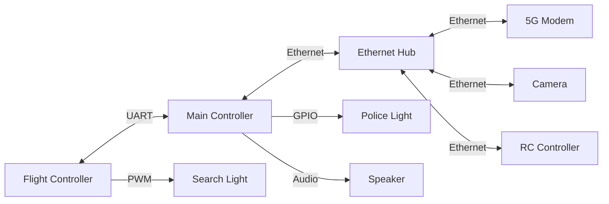

# TOV 시스템 Block Diagram

## 시스템 구성 한눈에 보기

```mermaid
flowchart LR
    FC[Flight Controller]
    MC[Main Controller]
    ETH[Ethernet Hub]
    G5[5G Modem]
    CAM[Camera]
    RC[RC Controller]
    SL[Search Light]
    PL[Police Light]
    SPK[Speaker]

    FC <-->|UART| MC
    FC -->|PWM| SL

    MC -->|GPIO| PL
    MC -->|Audio| SPK

    MC <-->|Ethernet| ETH
    ETH <-->|Ethernet| G5
    ETH <-->|Ethernet| CAM
    ETH <-->|Ethernet| RC
```
